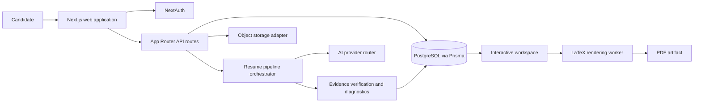

# Architecture

Career Command Center is a full-stack Next.js application that turns source career evidence and a target job description into a reviewable resume workspace and export flow.

## System map



## Product flow

1. A user uploads or pastes a source resume.
2. Intake and normalization produce structured career memory.
3. The target job description is analyzed for role language and evidence gaps.
4. Strategy, summary, and bullet agents build a draft through a persisted state machine.
5. Verification and diagnostics surface unsupported or missing evidence.
6. The workspace lets the user review and edit the result.
7. The separate LaTeX worker renders the approved document as PDF.
8. The application tracker can retain the downstream application record.

## Explicit state model

```text
UPLOADED -> PARSED -> NORMALIZED -> VERIFIED -> JD_ANALYZED
-> STRATEGY_READY -> GENERATING -> QA_REVIEWED -> USER_EDITING
-> EXPORTED -> TRACKED

Any processing state -> FAILED
FAILED -> UPLOADED (retry)
```

The state machine keeps progress inspectable, supports recovery, and prevents the user interface from substituting animation for actual backend state.

## Main boundaries

### Web and API

- `app/(marketing)/`: public product and resume-scan experience
- `app/(auth)/`: registration, sign-in, verification, and password recovery
- `app/(app)/`: authenticated dashboard, upload, workspace, export, and tracker
- `app/api/`: authenticated and public route handlers

### AI orchestration

- `agents/orchestrator/`: stateful pipeline coordination
- `agents/intake/` and `agents/normalizer/`: source extraction and career-memory construction
- `agents/jd-analyst/` and `agents/strategy/`: target analysis and content strategy
- `agents/bullet-writer/`, `agents/summary-writer/`, and `agents/verifier/`: draft generation and evidence checks
- `lib/ai/`: centralized provider routing; feature code does not call provider SDKs directly

### Data and identity

- `prisma/schema.prisma`: users, resumes, career memory, generated content, settings, and application tracking
- `lib/auth/`: NextAuth configuration and authorization helpers
- `lib/storage/`: storage adapter boundary
- `lib/config/`: encrypted operational configuration and environment fallback

### Export

- `lib/latex/`: deterministic document generation and worker client
- `workers/latex-renderer/`: isolated XeLaTeX HTTP service

## Trust boundaries

- Resume content is untrusted user input.
- AI output is treated as a proposal, not a fact source.
- User and resume ownership checks protect authenticated routes.
- Provider credentials stay in environment or encrypted configuration storage.
- Public repository fixtures are synthetic and continuously scanned.
- Final career claims require human review.

See [SECURITY.md](SECURITY.md) and [docs/SYNTHETIC_DATA.md](docs/SYNTHETIC_DATA.md) for the release-specific controls.
