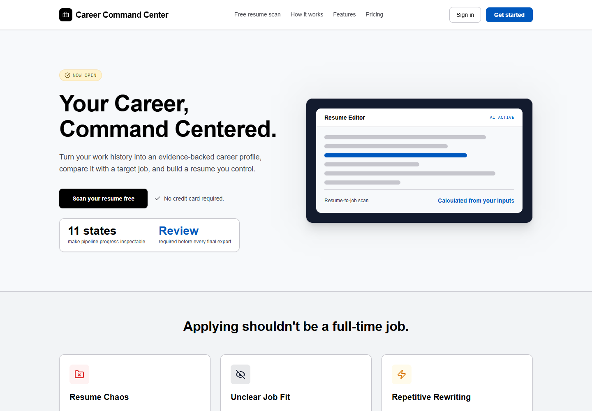
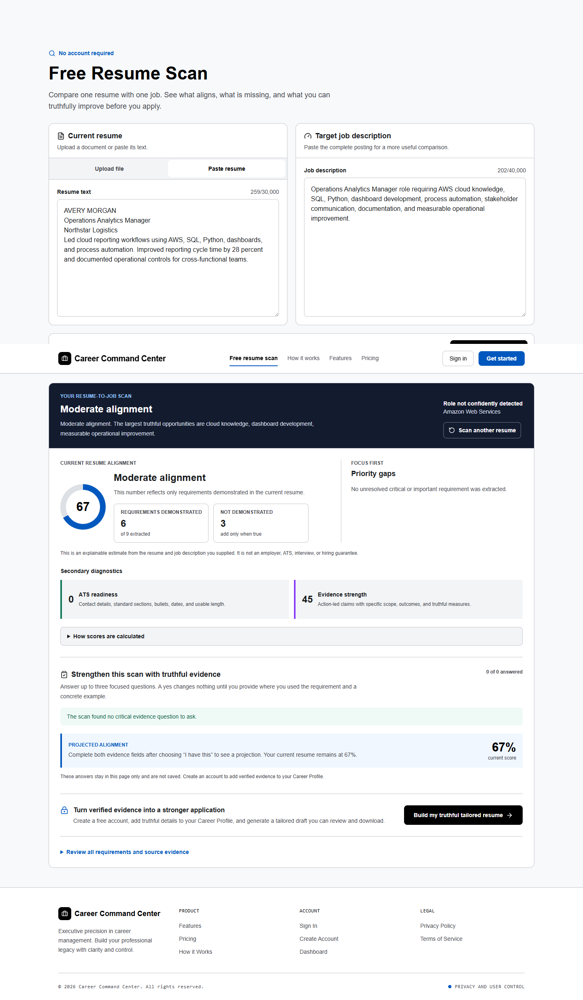

# Career Command Center

An evidence-aware career operating system for resume analysis, role-specific drafting, human review, PDF export, and application tracking.

[Live demo](https://career-command-center-hazel.vercel.app) · [Architecture](ARCHITECTURE.md) · [Security](SECURITY.md) · [Synthetic-data policy](docs/SYNTHETIC_DATA.md)

## The 30-second view

Career Command Center is a full-stack product, not a single prompt wrapped in a form. It combines authenticated accounts, persistent career memory, a multi-stage AI pipeline, an explainable resume-to-job scan, an editing workspace, deterministic PDF generation, and application tracking.

The engineering emphasis is trust: source evidence is normalized and persisted, generated content moves through explicit states and verification, users review the final claims, and the public repository contains synthetic data only.



## Product evidence

The public scan runs without an account and reports demonstrated requirements, evidence gaps, and scoring limitations. The example below uses a fully fictional resume and employer.



## What is implemented

- Upload and paste-based resume intake
- Reusable structured career profile and saved resume sources
- Public resume-to-job comparison with matched language and evidence gaps
- Multi-provider AI routing behind one application boundary
- Multi-stage resume orchestration with retryable persisted state
- Evidence reconciliation, unsupported-claim checks, and diagnostic scoring
- Interactive resume workspace and guided rewrite actions
- Separate LaTeX rendering service for PDF output
- Authentication, email verification, password recovery, and admin configuration
- Application tracker, dashboard, settings, and analytics surfaces

## Why the architecture matters

```text
Resume + target role
        |
        v
Intake -> Normalize -> Verify -> Analyze job -> Build strategy
        -> Generate -> Diagnose -> Human review -> Export -> Track
```

This makes failures observable and recoverable. Intermediate work is stored instead of disappearing inside one opaque model call, and provider access is centralized so generation code cannot silently bypass routing and configuration rules.

## Engineering evidence

| Area | Where to inspect | What it demonstrates |
|---|---|---|
| Orchestration | `agents/orchestrator/index.ts` | Explicit state transitions, retries, parallel work, and persisted outputs |
| Evidence controls | `agents/verifier/`, `lib/resume/` | Source reconciliation, quantified-evidence retention, and gap analysis |
| API design | `app/api/resume/`, `app/api/public/resume-scan/` | Authenticated ownership boundaries and public bounded analysis |
| Domain model | `prisma/schema.prisma` | Career memory, resume lifecycle, configuration, and tracking entities |
| Editing experience | `app/(app)/workspace/[resumeId]/page.tsx` | Real review and revision workflow |
| PDF system | `lib/latex/`, `workers/latex-renderer/` | Deterministic document construction in an isolated worker |
| Verification | `tests/`, `scripts/repository-safety.mjs` | Regression, API, hallucination, privacy, and repository-safety coverage |

## Technology

- Next.js 15, React 18, TypeScript, Tailwind CSS
- NextAuth 4, Prisma 5, PostgreSQL/Supabase
- Anthropic and OpenAI provider adapters
- Jest, ESLint, TypeScript compiler, CodeQL, dependency review
- Express-based XeLaTeX rendering worker
- Vercel-compatible web deployment

## Run locally

Requirements: Node.js 20, npm, and PostgreSQL. The PDF path additionally requires Docker.

```bash
cp .env.example .env.local
npm ci
npx prisma generate
npx prisma migrate deploy
npm run dev
```

The example environment file contains non-functional placeholders only. Real provider and database credentials are never committed.

Run the optional rendering worker:

```bash
cd workers/latex-renderer
docker build -t career-command-center-latex .
docker run --rm -p 4000:4000 career-command-center-latex
```

## Verify the repository

```bash
npm run safety:self-test
npm run safety:current
npm run lint
npm run typecheck
npm test -- --runInBand --silent
npm run build
npm audit --audit-level=high
npm run safety:history
```

The history gate is meaningful because this public edition starts from a sanitized snapshot with fresh Git history. The private development repository remains private and is not rewritten.

## Honest limitations

- AI drafting requires configured provider credentials and remains subject to provider behavior.
- Evidence checks reduce risk; they do not replace human review or guarantee factual perfection.
- Resume-to-job scores are explainable estimates, not employer, ATS, interview, or hiring predictions.
- PDF export requires the separate rendering worker.
- DOCX export is visible as disabled future work.
- The public demo is a technical portfolio deployment; do not upload confidential or regulated data.

## Repository safety

All public fixtures use fictional identities, fictional employers, reserved example email domains, and fictional `555-01xx` phone numbers. See [docs/SYNTHETIC_DATA.md](docs/SYNTHETIC_DATA.md).

Security issues should follow [SECURITY.md](SECURITY.md). General improvements can follow [CONTRIBUTING.md](CONTRIBUTING.md).
